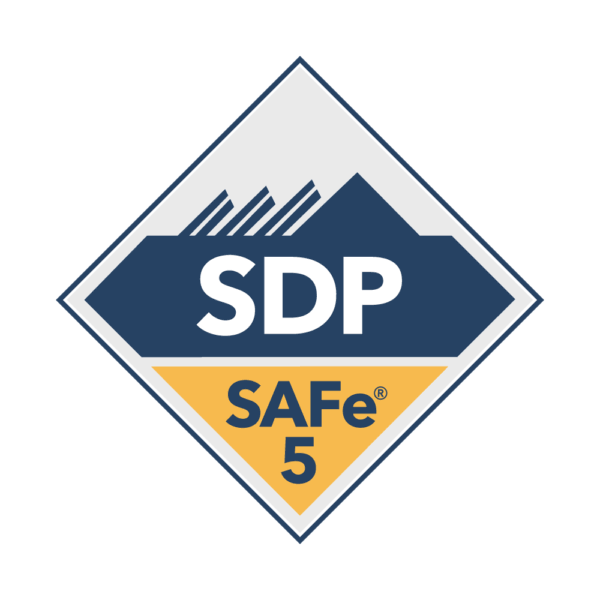
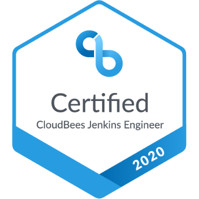

# Sagar Valagerehally Shankaraiah

**Senior Project Manager | Product Owner | DevOps Architect | AWS Certified | CICD Tools Expert**

### About me

!!! note "About me"

    A seasoned professional with rich experience in DevOps looking for opportunity in the areas of Architectural Solutions and to deliver complex designs. Adding 14+ years of experience in client facing role has given exposure on working with multi-tenant complex IT solutions and exposure to connect and work with Teams across globe and manage challenging stakeholders. 

    * Proven track record in delivering successful projects including Green Field and Transition projects
    * Experience on AWS Cloud platform and wide range of DevOps tools and projects rights from Code promotion to end deployment
    * Built pro-active proposals to achieve Continuous Quality in various domains including Quality Assurance
    * Created holistic view on Investment, TCO savings and ROI to achieve Business and IT KPI’s and simplify the IT landscape

    Building architectural designs to implement DevOps tools based on the business needs. Expert in tools evaluation, comparison, and building CICD pipeline including Continuous Testing and Continuous Monitoring.

    * Continuous Quality, Code Analytics and Code Coverage implementation with Jenkins pipeline automation to shift left
    * Provide recommendations for tools selection by analyzing and evaluating from the wide range of DevOps Tools
    * Strong grip on best practices and industry standard proven tool solution, there by enabled right fitment of required tooling for complex business requirement
    * Well versed with Kanban Agile delivery methodology

<figure markdown>
  { width="300" }
  <figcaption>SAFe DevOps Practitioner 2023</figcaption>
</figure>

<figure markdown>
  { width="100" }
  <figcaption>SAFe DevOps Practitioner 2023</figcaption>
</figure>

<iframe
  src="https://certificates.cloudbees.com/embed/0a217355-d854-4cc7-9bfd-7d576e72127c"
  width="800"
  height="600"
  frameborder="0"
  allowfullscreen>
</iframe>

    

    

    

!!! tip "DevOps Tools:"

    * GitHub Enterprise
    * JFrog Artifactory
    * Jenkins Enterprise (CloudBees Edidions)
    * Nexus Pro
    * Quality Center (ALM) 
    * SonarQube Data Center Edition
    * CAST
    * Urban-Code{Deploy} 
    
